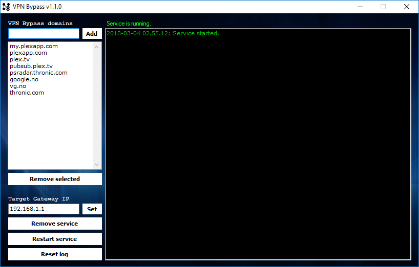

## VPN Bypass | Local Domain Based Routing
VPN Bypass can bypass local VPN, by routing specific domains to the local gateway, like it would usually work when VPN is not active.

VPN providers that implement their own traffic inspection and firewall filter will not be bypassed by this software. So your mileage may vary. Any existing antivirus solution must also accept automatic hosts file changes for VPN Bypass to work optimally. 

Tested with TigerVPN, OpenVPN (should work with all providers supporting and using it) and F-Secure FREEDOME. Originally made for Plex, which uses Amazon CDN and rotating/load balancing IP addresses, making simple scripts inadequate. 

This software installs/removes an added service via the user interface that keeps all hosts in the list updated. (Version 1.2.0+ now also supports round-robin / load balancing where a single domain may point to multiple IP adresses). 

If your VPN metric is lower than default Bypass routes, just turn off automatic metric in your NIC and set it to 1. This is a setting available in ncpa.cpl > NIC Properties > TCP/IPv4 properties > Advanced.

TIP: You do not need to have client program open (some users seem to think so), it's just for viewing log and stop/starting the service. 

## Changelog
**2019.05.02: Updated Windows & GNU/Linux Release 1.2.0** 
[+] Upgraded DNS handling with support for round-robin A records. 

**2019.05.02: Updated Windows & GNU/Linux Release 1.2.0**
[+] Upgraded DNS handling with support for round-robin A records.

**2018.03.04: Updated Windows Release 1.1.0**
[🛠]Improved DNS cache handling.
[🛠]Cleaned up the service log format a bit.
[🛠]Made some changes on GUI and ease of use.
[🛠]Misc. optimizations and bug fixes.
[+] New icon.

**2018.02.12: Updated Linux Release 1.0 final!**
[🛠]Misc improvements and testing for Debian 9 and Ubuntu 16.04.

**2016.03.30: Updated Linux Release 0.9.0.2**
[🛠] Improved explicit outgoing scope on incoming traffic.
[🛠] Improved custom routing rules cleanup on removal.

**2015.12.11: Updated Windows Release 1.0.0.38**
[🛠]Better survival through network crashes/disconnects.
[🛠]Better updating algorithm to avoid possible interrupts.
[+] New datafile that will help to perform proper cleanups.
[🛠]Now accepts and handles dns balancing much better.

**2015.11.13: Updated Linux Release 0.9.0.1**
[+] Log now has timestamps and is more relaxed and clear.
[+] New system command: VPBN will show aggregated status.
[+] Wrapped install/uninstall into single script.
[🛠]Better survival through network crashes/disconnects.
[🛠]Better updating algorithm to avoid possible interrupts.
[+] New datafile that will help to perform proper cleanups.
[+] Uses dig instead of .NET/Mono to avoid any caching.
